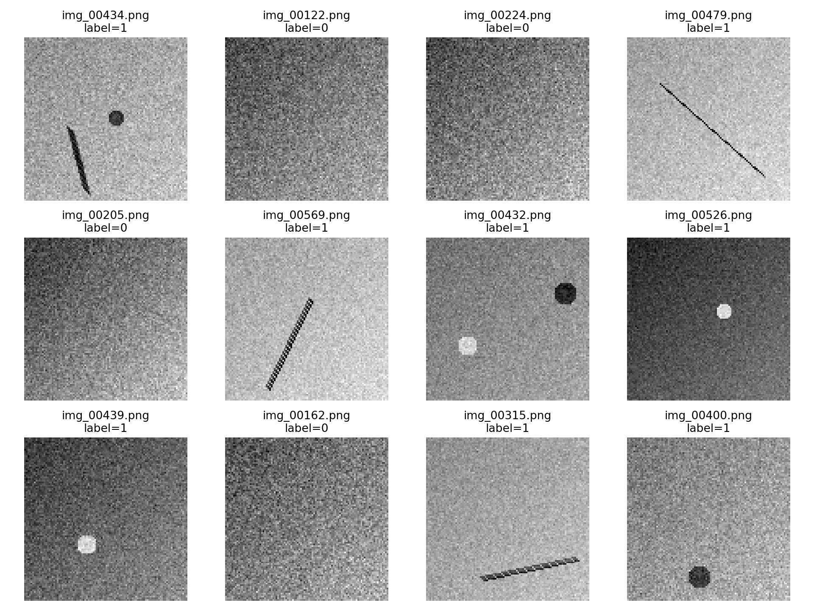
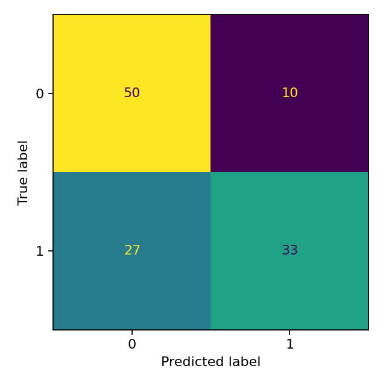

# Defect Classifier on Surface Images (ML Project)

โปรเจกต์สาธิตการจำแนกภาพพื้นผิว **ปกติ (0)** กับ **มี defect (1)** ด้วย Machine Learning + Image Processing  
โค้ดนี้ออกแบบให้รันได้ง่ายบนเครื่องส่วนตัว (Python 3.10+)

## โครงสร้างโปรเจกต์
```
defect-classifier-starter/
├─ src/
│  ├─ features.py
├─ data/              # (ว่างตอนเริ่ม) จะมี images/ และ labels.csv หลังรัน generate_dataset.py
├─ models/            # เก็บโมเดลที่ train แล้ว (.pkl)
├─ outputs/           # เก็บผลลัพธ์ เช่น confusion_matrix.png, classification_report.txt
├─ generate_dataset.py
├─ train.py
├─ evaluate.py
├─ visualize_samples.py
├─ requirements.txt
└─ .gitignore
```
> หมายเหตุ: โฟลเดอร์ `data/`, `models/`, `outputs/` ถูก ignore เวลา push ขึ้น GitHub อยู่แล้ว

---

## ติดตั้ง (Setup)
```bash
# 1) เตรียม Python env
python -m venv .venv
# Windows: .venv\Scripts\activate
# macOS/Linux:
source .venv/bin/activate

# 2) ติดตั้งไลบรารี
pip install --upgrade pip
pip install -r requirements.txt
```

---

## สร้างชุดข้อมูลตัวอย่าง (Synthetic Dataset)
```bash
python generate_dataset.py --n 600 --size 100 --out data
```
หลังรันจะได้:
- `data/images/*.png`  : รูป grayscale 100x100 (ปกติ/มี defect)
- `data/labels.csv`    : ไฟล์ label (0/1) ผูกกับชื่อไฟล์

พารามิเตอร์ที่ปรับได้:
- `--n`   จำนวนภาพทั้งหมด (default: 400)
- `--size` ขนาดรูปสี่เหลี่ยม (default: 100)
- `--seed` ค่า random seed (default: 42)

---

## เทรนโมเดล (Train)
```bash
python train.py --features hog+stats --model svm --test-size 0.2
```
- `--features` เลือก `hog`, `stats`, หรือ `hog+stats`  
- `--model`    เลือก `svm` หรือ `rf` (Random Forest)
- `--test-size` สัดส่วน test split (default: 0.2)

ผลลัพธ์:
- `outputs/confusion_matrix.png`
- `outputs/classification_report.txt`
- โมเดลบันทึกที่ `models/model_<model>_<features>.pkl`
- ตัวแยกสเกล/เมตาดาต้าบันทึกในไฟล์เดียวกัน (ผ่าน `joblib`)

---

## ประเมิน/ลองทำนาย (Evaluate / Predict)
1) ประเมินบน test split เดียวกับตอนเทรน:
```bash
python evaluate.py --use-saved-test
```
> ใช้ไฟล์ `outputs/test_split.csv` ที่ถูกสร้างตอน train

2) ทำนายรูปในโฟลเดอร์ใหม่ (ไม่มี labels ก็ได้):
```bash
python evaluate.py --predict-dir some_folder_of_images
```

---

## ดูตัวอย่างรูป (Visualize)
```bash
python visualize_samples.py --k 12
```

---

## แนวคิดฟีเจอร์
- **HOG (Histogram of Oriented Gradients)**: จับรูปแบบเส้นขอบ/ทิศทางขอบภาพ เหมาะกับรอยขีด/เส้น
- **Stats (สถิติพื้นฐาน)**: mean, std, edge density (สัดส่วนขอบภาพ), high‑gradient ratio ฯลฯ


---

# Defect Classifier on Surface Images (ML Project)

โปรเจกต์สาธิตการจำแนกภาพพื้นผิว **ปกติ (0)** กับ **มี defect (1)** ด้วย Machine Learning + Image Processing  
โค้ดนี้ออกแบบให้รันได้ง่ายบนเครื่องส่วนตัว (Python 3.10+)

---

## 📂 Example Output

| Sample Grid (ภาพตัวอย่างจาก Dataset) | Confusion Matrix (ผลการจำแนก) |
|--------------------------------------|--------------------------------|
|  |  |
| ตัวอย่างภาพปกติ/defect ที่ใช้ในการ train/test | ความถูกต้องของโมเดลในแต่ละคลาส |

---

### 🔹 Classification Report
ไฟล์ `outputs/classification_report.txt`  
ตัวอย่างเนื้อหา:
